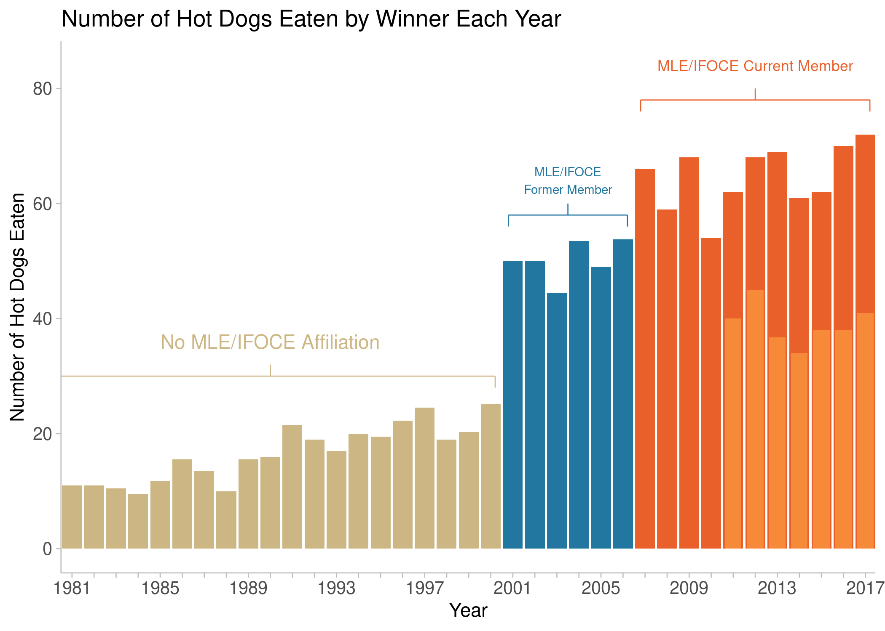

```{r setup, include=FALSE}
knitr::opts_chunk$set(echo = TRUE)
library(tidyverse)
library(here)
library(extrafont)
library(ggthemes)
```

```{r pressure, echo=FALSE, out.width = '80%', fig.align='center'}
#
```

## 1) Description
This is a bar plot showing the number of hot dogs eaten per year by the winner of Nathan's Hot Dog Eating Contest. Additionally, information about the establishment of the IOFCE (Major League Eating) and its potential effect on the results of the contest are included. Female participants were included from 2011 and are shown in an overlay.

## 2) Description of the data
```{r, echo= FALSE}
# load data frame
hdm_affil <- read_csv(here::here("data", "hot_dog_contest_with_affiliation.csv"))

# wrangle
hdm_affil <- hdm_affil %>%
  mutate(gender = as_factor(gender),
         affiliated = as_factor(affiliated),
         post_ifoce = year >= 1997) %>%
  filter(year >= 1981 & gender == "male")

# take a look
glimpse(hdm_affil)
```

The data are derived from Nathans Hot Dog Eating Contest results (and supplied by Steve Bedrick), and include information on the year of the contest, the name of the winner(s) by gender, their affiliation with IOFCE, and the number of hot dogs eaten to win.

## 3) Representation

The purpose of this graph is primarily to show the change in hot dogs eaten to win the contest over time, and further to investigate how the organization of a professional eating league may have influenced the results. To achieve this, time is displayed on the x-axis and one bar is assigned to each year that we have data from 1980 on. The size of the bars is directly correlated to the y-axis value for the numeric quantity of hot dogs eaten. Color is utilized to distinguish whether the winner is affiliated with the professional eating organization.

## 4) How to read it

Barplots, and similarly histograms, are fairly intuitive to interpret. In a barplot, the x-axis is typically categorical, where you can compare quanities, etc. between them and a histogram will usually have a continuous, numeric x-axis. Given that we have a discrete numeric x-axis, it can really be considered either. With a linear y-axis, the comparison of sizes of the bar is a great way for us to visually compare the quantities of hot dogs eaten by the winners each year. 

## 5) Presentation tips

Here, color is used to distinguish between the affiliations, adding another layer of information upon our bar plot. Instead of a legend, we use annotations to show our viewer what affiliation each color corresponds to, allowing our plot to take up more space and creating a more aesthetically pleasing display.

## 6) Variations and alternatives

As touched on earlier, histograms are commonly used to display continuous numerical data, and typically look similar to a bar plot. Histograms can display how data change with a high level of granularity. Similarly, line plots can be used to illustrate a similar relationship as a bar plot. With a line plot, a point is plotted each year at the corresponding y-axis value for hot dogs eaten and connected. These plots work well if the focus is the change over time, or the trend. I would argue bar plots do a better job of comparing quantities over time.

## 7) How to create it

### Data wrangling

```{r}
hdm_affil <- read_csv(here::here("data", "hot_dog_contest_with_affiliation.csv"))

hdm_affil <- hdm_affil %>%
  mutate(gender = as_factor(gender),
         affiliated = as_factor(affiliated),
         post_ifoce = year >= 1997) %>%
  filter(year >= 1981 & gender == "male")
```


### Create base plot
```{r}
pal <- c("#E9602B", "#2277A0", "#CCB683") ## custom color palette

affil_plot <- hdm_affil %>%
  ggplot() +
  aes(x = year, y = num_eaten, fill = affiliated) +
  labs(x = "Year", y = "Number of Hot Dogs Eaten", 
       title = "Number of Hot Dogs Eaten by Winner Each Year") +
  scale_fill_manual(values = pal, name = "IFOCE-affiliation") +
  geom_col()
affil_plot
```


### Create a Custom Theme
```{r}
## call the theme dawgs
dawgs <- theme(plot.title = element_text(hjust = 0),
        axis.text = element_text(size = 10),
        panel.background = element_blank(),
        axis.line.x = element_line(color = "grey", size = 0.3),
        axis.line.y = element_line(color = "grey", size = 0.3),
        axis.ticks = element_line(color = "grey", size = 0.3))

#try it out
affil_plot + 
  dawgs
```

### Custom tick marks, labels
```{r}
years_lbl <- seq(1981, 2021, by = 4)

hd_years <- hdm_affil %>%
  distinct(year) %>%
  mutate(year_lab = ifelse(year %in% years_lbl, year, ""))

affil_plot +
  dawgs +
  scale_x_continuous(expand = c(0,0), breaks = hd_years$year, labels = hd_years$year_lab)
```

### Adding annotations
```{r}
affil_ann <- affil_plot +
  dawgs +
  scale_x_continuous(expand = c(0,0), breaks = hd_years$year, labels = hd_years$year_lab) +
  guides(scale = "none") +
  annotate('segment', x = 1980.5, xend = 2000.2, y = 30, yend = 30, size = 0.3, color = "#CCB683") +
  annotate('segment', x = 1980.5, xend = 1980.5, y = 30, yend = 28, size = 0.3, color = "#CCB683") +
  annotate('segment', x = 2000.2, xend = 2000.2, y = 30, yend = 28, size = 0.3, color = "#CCB683") +
  annotate('segment', x = 1990, xend = 1990, y = 30, yend = 32, size = 0.3, color = "#CCB683") +
  annotate('text', x = 1990, y = 36, label = "No MLE/IFOCE Affiliation", color = "#CCB683")+
  annotate('segment', x = 2000.8, xend = 2006.2, y = 58, yend = 58, size = 0.3, color = "#2277A0") +
  annotate('segment', x = 2006.2, xend = 2006.2, y = 58, yend = 56, size = 0.3, color = "#2277A0") +
  annotate('segment', x = 2000.8, xend = 2000.8, y = 58, yend = 56, size = 0.3, color = "#2277A0") +
  annotate('segment', x = 2003.5, xend = 2003.5, y = 58, yend = 60, size = 0.3, color = "#2277A0") +
  annotate('text', x = 2003.5, y = 64, label = "MLE/IFOCE\nFormer Member", color = "#2277A0", size = 2.5) +
  annotate('segment', x = 2006.8, xend = 2017.2, y = 78, yend = 78, size = 0.3, color = "#E9602B") +
  annotate('segment', x = 2006.8, xend = 2006.8, y = 78, yend = 76, size = 0.3, color = "#E9602B") +
  annotate('segment', x = 2017.2, xend = 2017.2, y = 78, yend = 76, size = 0.3, color = "#E9602B") +
  annotate('segment', x = 2012, xend = 2012, y = 78, yend = 80, size = 0.3, color = "#E9602B") +
  annotate('text', x = 2012, y = 84, label = "MLE/IFOCE Current Member", color = "#E9602B", size = 3)
```

### Add female data, finalize

```{r}
# read in data, wrangle
hdm_fem <- read_csv(here::here("data", "hot_dog_contest_with_affiliation.csv"),
                    col_types = cols(affiliated = col_factor(levels = NULL),
                                     gender = col_factor(levels = NULL))) %>%
                      mutate(post_ifoce = year >= 1997) %>%
                      filter(year >= 1974 & gender == "female")
                    

affil_with_fem <- affil_ann +
  geom_col(data = hdm_fem,
           width = 0.75,
           fill = "#F68A39") +
  labs(subtitle = NULL) + 
  theme(legend.position = "none")
affil_with_fem
```
